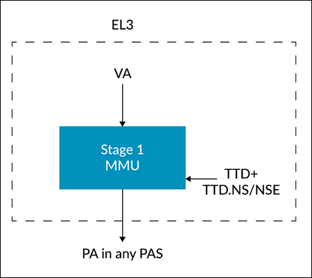
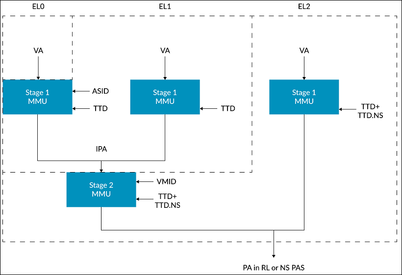
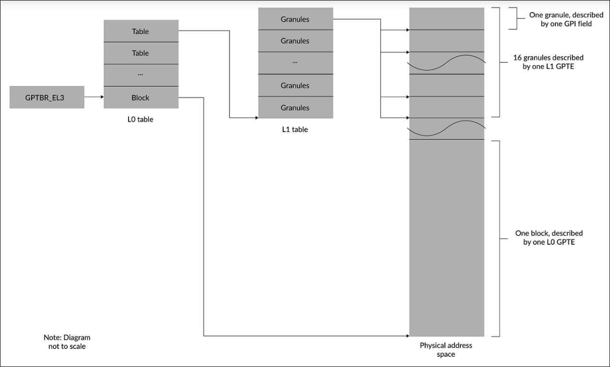
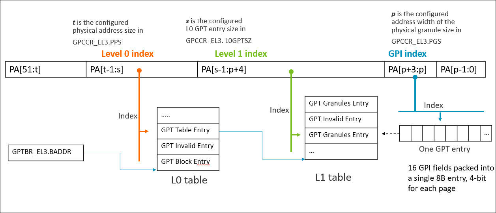

# Security States
- Now we have 4 different security states:
		- Non-secure
		- Secure
		- Realm
		- Root
	- In order to move between the security states one bit it is not more sufficient, so we have 2 bits always in the `SCR_EL3` register
	  |`SCR_EL3.NS`|`SCR_EL3.NSE`|Security State|
	  |0|0|Secure state|
	  |1|0|Non-secure state|
	  |0|1|Non defined|
	  |1|1|Realm|
	  It is important to say that the root state has not a configuration of these bits however this register can be updated only at EL3 so only in the root state and the values in these bits are displaying in which state for example the root state has to be performed a TLB invalidation
	- Respect to [[AISS.Project.ArmTrustZone]], RME has 4 security states so also four physical addresses space (PAS) and it is worth to say that root state can access always every PAS, Non-secure PAS can be accessed in every state and the secure and realm have only access to their own PAS and the non-secure one of course. The prefix are
		- `SP:0x...`, secure PAS
		- `NP:0x...`, non-secure PAS
		- `RLP:0x...`, Realm PAS
		- `RTP:0x...`, Root PAS
- # Physical Addresses
	- In order to translate between virtual and physical addresses, there are 4 different translation regimes, one for each one security state:
		- 
		  It has the dispatching between the differen PAS through the same configuration of the `NS` and `NSE` bits as before however it is another register `TTD` but root has also a code `(NSE,NS) = {1,0}`
		- 
		  It is more complicated but it is equal as the secure one, only the difference here that it is accessed the realm PAS and the `NS` bit is used to differentiatew between it `(0)` or non-secure PAS `(1)`
		- The secure and non-secure are analog to the real one with the only differences that the secure translation regimes will have access to secure and non-secure PAS and non-secure translation regimes only to non-secure PAS (so `NS` bit is not used)
	- Now we expand the TLB and cache theory of `TrustZone` with four states
- # Granule Protection Checks
	- The Granule Protection checks are the one responsible to have dynamic assignment between different physical address spaces. In order to check on which PAS the address it is Granule Protection Table exist. There is also a completer-side filtering that is used when the memory system enforces isolation, so the isolation is done by the peripheral (on-chip RAM-ROM) or by the interconnect (GIC). The GPC is used by the MMU to allow or deny access to the memory if the PA is inside the PAS where the requester can have access
		- ## GPTs
			- They are the tables where the information about the PAS are stored, only accessible via EL3, so root state, the base address of the level 0 table is stored in `GPTBR_EL3`
			  
			- The mechanism is that the level 0 table could be use
				- Block descriptor, so an entire block has the same PAS described in the `GPTE` of the level 0 table
				- Table descriptor, so the entry of the level 0 now is a PA that points to a level 1 table in which each granule is described so possible with different PAS associated
			- So in level 1 table, each entry (`L1 GPTE`) can be:
				- Granule descriptors, so it describes 16 granules so each one granule has been described with its own PAS
				- Contiguous Descriptor, allow to describe more large memory so enabling more efficient use of TLBs
			- The `GPTE` as described before are the entries of each table and the field that describe the PAS associated to a granule of the `GPTE` is called `GCI`, so the idea is to get this GCI to get the PAS assigned to a region of memory. Note that each `L1 GPTE` has 16 `GCI` but each `GCI` can referred to `4KB-16KB-64KB` region of memory
			  
		- There are different types of faults that are rising if the walks of the GPT is completed but the access was not permitted or also if the walks are stopped before the end for different causes
		- In order to transition a memory region between different PAS the GPT entry has to be changed so how to mentain consistent caches and TLBs?
			- Caches adopt PoPa (Point of Physical Aliasing) where beyond that point an access that uses any PA space uses the same copy in a cache or memory. So beyond a point the PAS are not stored and the software is responsible to invalidate the cache entries
			- Also TLBs have to be invalidate after a transition the entries
		- The GPC bypass windows are the memory region in which each PAS can access and they are used for completer-side  PAS filters (RAM and ROM on-chip and so on)
- # System architecture
	- The MPE (Memory Protection Engine) are the component to ensure confidentiality and integrity of the data
	- The memory partitioning and monitor extension is configured so that the system integrator decide on how they can be implemented on each security state, because an incorrect use of it, can lead to side channels attacks
	- In order to guarantee isolation boundaries, integrity and confidentiality with RSA features, it is important that if we want the errors to be triaged in another security state it is important to define which is confidential and which data no. So what is non confidential can be seen by all the states instead the confidential ones only by the schema that is specific of RME
	- Other two PA spaces were introduced after RME, the non-secure protected and system agent, in order to guarantee Granule Data Isolation, that is the feature that a software can manage a buffer associated to another device without compromising the confidentiality of the buffer, like for example trusted-media-pipe. New bit `NSE2` in parallel to `NS` and `NSE`
- # SMMU
	- The access of a memory location by a device, except the CPU that has the MMU, has to be validated or by the memory system if the region accessed relies on completer-side filtering or by the SMMU, but as we said before now we have dynamic allocations of PAS so a the GPC have to be performed so in every SMMU a GPC has to be inserted and also in the devices that before they were based on the memory system (example GIC)
	- In this context we can have devices that have a `SEC_ID` but only for secure and non-secure devices (real and root not supported), but also devices that have no `streamID` the ones that in `TrustZone` they do not have an SMMU and so they have to be supported only for GPC and not translation stages. In the end als SMMU-originated access have to deal with GPC and if it fails it raises an external abort
	- Supporting GPC by the SMMU implies that its originated access are subject to GPC and also the ones of the client device
		- In order to support a register defines if the access are subject to GPC or no via the fields `ACCESSEN` and `GPCEN` in the `SMMU_ROOT_CR0` register
		- The TLBs have to be updated when a granule is reassigned so the SMMU with RME participate in the invalidation process
		- There are GPC faults also here divided in Granule Protection Fault, GPT lookup table and fault arising from RAS errors. The SMMU with RME has two additional interrupts.
- # Memory Encryption Contexts extension
	- In the Realm PAS there is support for multiple encryption contexts, so not anymore one single encryption context
		- In order to accomplish this, need of the Memory Encryption Context IDs are needed (MECID), so each MECID is bound to a cryptographic context for encrypted memory locations. It is possible that a single MECID can be bound to different cryptographic contexts, needed for different resources
		- The width of the MECID can be from 1 to 16 bits, it is recommended to use the same width all over the PE
		- If there is a mismatch of the MECID in the cache, a data abort or translation fault is raised
		- The memory protection engine MPE is the component that encrypt the data before the store on the external disk and decrypts when it is read, the keys or tweaks of tese contexts are stored in MECID-indexed tables or MECID-tagged caches. MPE is configured by Monitor Security Domain at EL3 or Trusted subsytem or an autonomous hardware component
		- The blocks can be 64 ore 128 bytes
		- MECIDs enforce rigorous isolation between different Realm memory regions, typically associated with individual Realm. By associating transactions with their respective MECIDs, the MPE ensures data is encrypted uniquely for each Realm, so each Realm is bounded to itself and cannot decrypt data of another Realm
		- [link](https://developer.arm.com/documentation/den0126/0102/Memory-Encryption-Contexts-extension/MECID-on-SMMU-for-RME-DA)
		-
